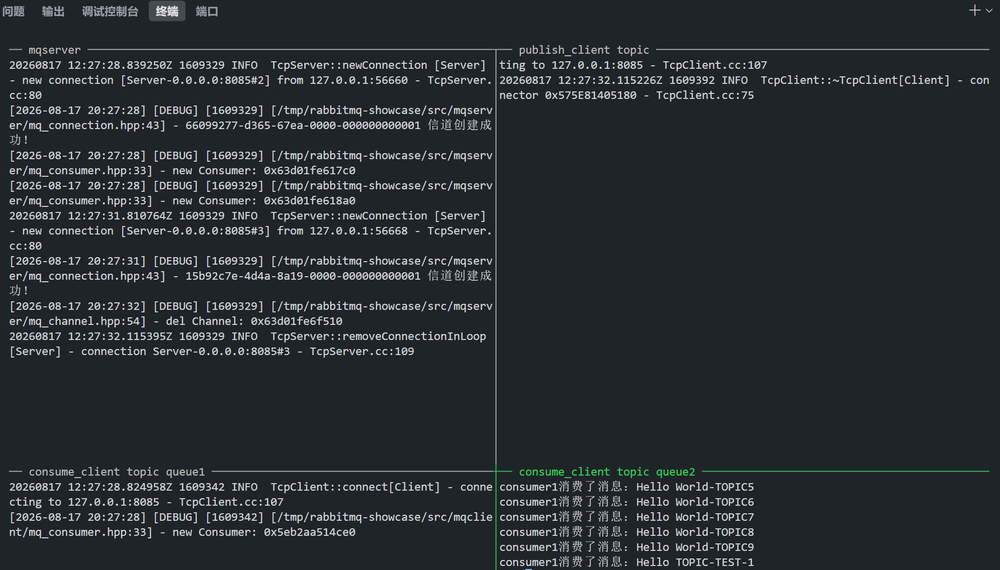
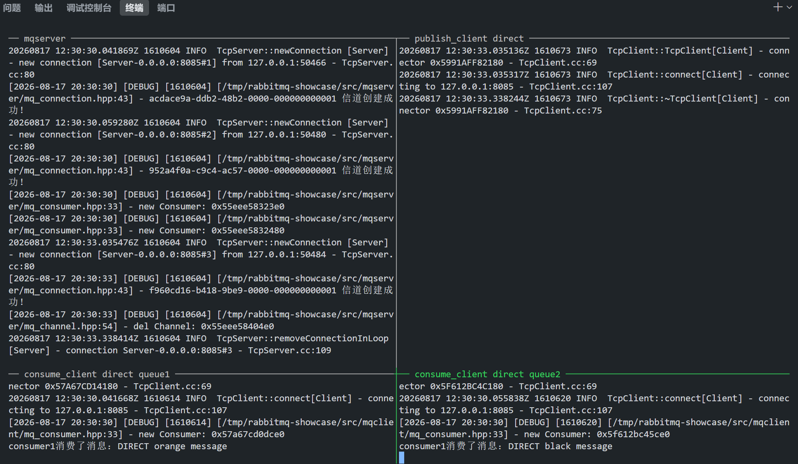
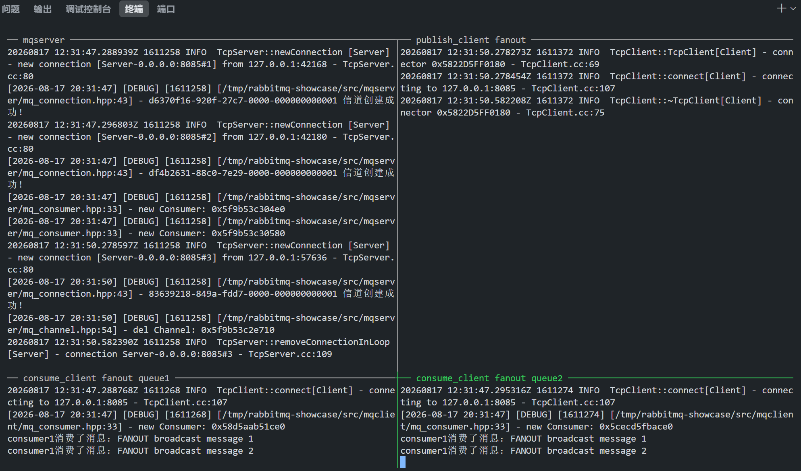
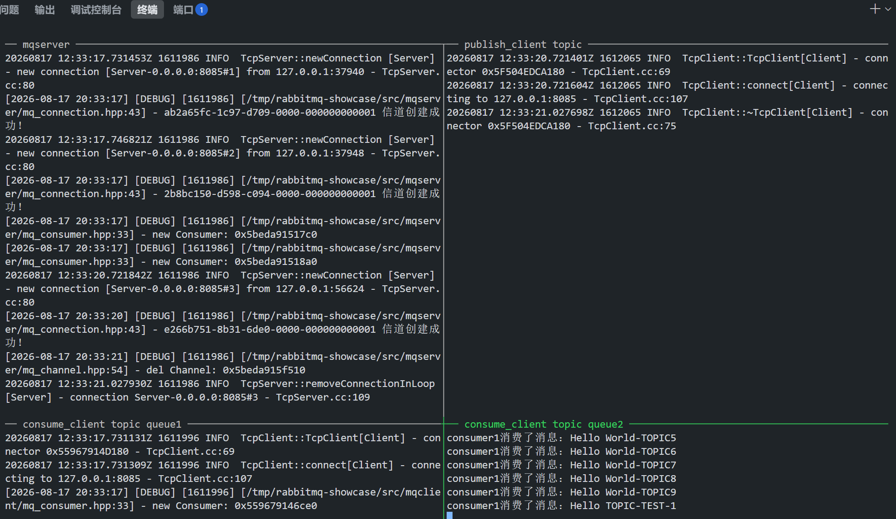
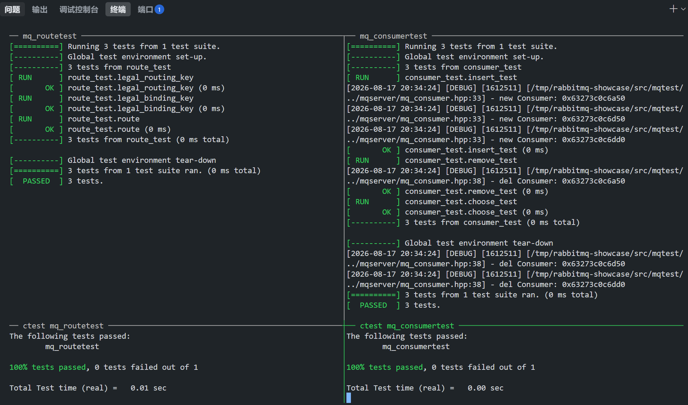
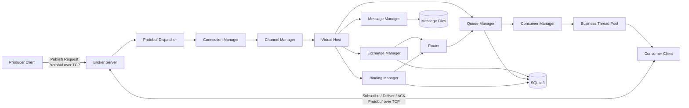
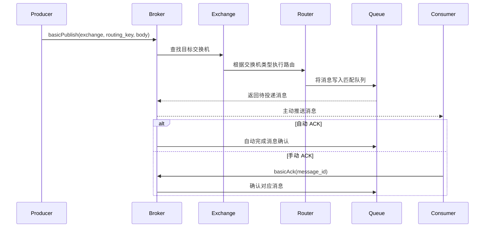

# cpp-rabbitmq

> A lightweight RabbitMQ-like message broker implemented in C++.

基于 **C++11/17、muduo、Protobuf 和 SQLite3** 实现的轻量级消息队列系统，包含 Broker 服务端、客户端 SDK、交换机与队列管理、消息路由、消息持久化、消费者调度和 ACK 消息确认等核心模块。

项目使用 muduo 构建 TCP 长连接通信，使用 Protobuf 定义客户端与服务端之间的应用层通信协议，并实现类似 RabbitMQ 的 `Connection / Channel` 分层通信模型。

> 本项目没有实现完整的 AMQP 协议，而是通过自定义 Protobuf 协议，重点实现消息队列的核心通信链路与关键机制。

## 项目状态

- 当前版本：`v1.0.0`
- 编程语言：C++11/17
- 运行平台：Linux
- 网络通信：muduo + epoll + TCP 长连接
- 序列化协议：Protobuf
- 元数据存储：SQLite3
- 消息存储：文件持久化
- 测试框架：GTest
- 构建工具：Makefile

## 项目演示

### 消息发布、路由、消费与手动 ACK

下面展示 Broker、Producer 和 Consumer 三端联调效果。

Producer 通过 TCP 长连接向 Broker 发布消息，Broker 根据交换机类型和路由键将消息写入匹配队列，再主动推送给已经订阅队列的 Consumer。Consumer 处理消息后调用 `basicAck()` 完成手动确认。

<p align="center">
  
</p>

### 三种交换机路由效果

#### Direct：精确匹配

`queue1` 和 `queue2` 分别使用 `orange`、`black` 作为绑定键。Producer 发布 `orange`、`black` 和 `green` 三条消息：前两条分别进入对应队列，`green` 因没有匹配的绑定而不会被投递。

<p align="center">
  
</p>

#### Fanout：广播

`FANOUT` 交换机忽略路由键，将每条消息投递到所有已绑定队列。示例中的两条广播消息都会同时进入 `queue1` 和 `queue2`。

<p align="center">
  
</p>

#### Topic：通配符匹配

`queue1` 的绑定键为 `queue1`，`queue2` 的绑定键为 `news.music.#`。本次发布的消息中，`news.music.pop` 和 `news.music.sport` 会进入 `queue2`，`news.sport.sport` 不匹配；`queue1` 不会收到这组消息。

| Routing Key | `queue2` 是否匹配 |
| --- | --- |
| `news.music.pop` | 是 |
| `news.music.sport` | 是 |
| `news.sport.sport` | 否 |

<p align="center">
  
</p>

### GTest 测试结果

截图展示路由匹配与消费者管理两组 GTest 的真实运行结果。

<p align="center">
  
</p>

## 项目亮点

- 基于 muduo、epoll 和 TCP 长连接实现事件驱动网络通信
- 使用 Protobuf 定义请求、响应和消息投递协议
- 实现一个 `Connection` 管理多个 `Channel` 的分层通信模型
- 支持 `DIRECT`、`FANOUT` 和 `TOPIC` 三种交换机类型
- 使用动态规划实现 Topic 模式下 `*` 和 `#` 通配符匹配
- 支持多个消费者之间的 Round Robin 轮询调度
- 支持自动 ACK 和手动 ACK 两种消息确认方式
- 使用 SQLite3 持久化交换机、队列和绑定关系
- 使用文件存储实现队列消息持久化与 Broker 重启恢复
- 基于请求 ID、哈希表、互斥锁和条件变量实现请求响应关联
- 将网络 I/O 与业务任务分离，避免业务处理阻塞事件循环
- 使用 GTest 验证路由、消费、持久化和资源清理等核心逻辑

## 技术栈

| 技术 | 用途 |
| --- | --- |
| C++11/17 | 项目主要开发语言 |
| muduo | TCP 服务端、客户端、事件循环和网络通信 |
| epoll | Linux 事件驱动 I/O 多路复用 |
| Protobuf | 应用层协议定义、序列化和反序列化 |
| SQLite3 | 交换机、队列和绑定关系等元数据持久化 |
| 文件存储 | 队列消息持久化与 Broker 重启恢复 |
| pthread | 多线程和业务线程池支持 |
| GTest | 核心模块单元测试 |
| Makefile | 项目编译与链接 |

## 核心功能

### 交换机与队列管理

- 声明、删除和查询交换机
- 声明、删除和查询消息队列
- 创建和解除交换机与队列之间的绑定关系
- 删除交换机时清理对应绑定关系
- 删除队列时清理绑定、消息、消费者和持久化文件
- 支持持久化和非持久化资源属性

### 消息路由

项目支持三种交换机类型：

| 交换机类型 | 路由规则 |
| --- | --- |
| `DIRECT` | `routing_key` 与 `binding_key` 完全相同时匹配 |
| `FANOUT` | 忽略路由键，将消息广播到所有绑定队列 |
| `TOPIC` | 使用 `*` 和 `#` 通配符进行模式匹配 |

Topic 通配符规则：

| 通配符 | 含义 |
| --- | --- |
| `*` | 匹配恰好一个单词 |
| `#` | 匹配零个或多个单词 |

示例：

```text
binding_key = news.*.pop
routing_key = news.music.pop
result      = true
```

```text
binding_key = news.#
routing_key = news.music.pop
result      = true
```

### 消息发布与消费

- 生产者向指定交换机发布消息
- Broker 根据交换机类型和路由键查找目标队列
- 消息进入匹配的一个或多个队列
- Broker 主动向已经订阅队列的消费者推送消息
- 同一个队列可以注册多个消费者
- 多个消费者之间采用 Round Robin 轮询方式分发消息

### ACK 消息确认

项目支持两种确认方式：

- **自动 ACK：** 消费流程自动完成消息确认
- **手动 ACK：** 消费者处理完成后主动调用 `basicAck()` 确认消息

手动 ACK 可以让业务代码在消息处理成功后再确认消息，避免消息在业务处理完成前被提前删除。

### 数据持久化

- 使用 SQLite3 保存交换机、队列和绑定关系等元数据
- 使用独立队列文件保存持久化消息
- Broker 启动时加载持久化资源
- 根据队列文件恢复历史消息
- 删除队列时同步清理持久化数据

## 系统架构



## 消息流转过程



## 核心设计

### Reactor 网络通信模型

项目使用 muduo 构建 TCP 服务端和客户端。

muduo 底层基于 Reactor 模式和 epoll 实现事件驱动网络通信。网络线程主要负责：

- 接收客户端连接
- 监听套接字读写事件
- 接收和发送网络数据
- Protobuf 消息编解码
- 根据消息类型分发请求

业务线程池负责执行消息消费等业务任务，避免耗时业务逻辑长时间阻塞网络事件循环。

```text
网络线程
    │
    ├── 接收连接
    ├── 读取网络数据
    ├── Protobuf 解码
    └── 请求分发
            │
            ▼
       业务线程池
            │
            ├── 消费任务
            ├── 消息处理
            └── 回调执行
```

### Connection 与 Channel 分层

一个 TCP 连接对应一个服务端 `Connection` 对象。

一个 `Connection` 可以管理多个 `Channel`，交换机、队列、发布和消费等操作都通过指定的 Channel 完成。

```text
TCP Connection
├── Channel 1
├── Channel 2
└── Channel 3
```

这种设计能够复用同一条 TCP 连接，同时对不同业务操作进行逻辑隔离，减少频繁创建网络连接带来的开销。

### Protobuf 应用层协议

客户端和服务端通过 `.proto` 文件统一定义：

- 交换机和队列属性
- 消息基本属性
- Channel 创建与关闭请求
- 交换机和队列操作请求
- 消息发布与订阅请求
- ACK 确认请求
- 通用响应消息
- 服务端消息投递消息

服务端使用 `ProtobufDispatcher` 根据 Protobuf 消息类型，将请求分发给对应的业务处理函数。

```text
TCP 字节流
    │
    ▼
ProtobufCodec
    │
    ▼
Protobuf Message
    │
    ▼
ProtobufDispatcher
    │
    ▼
业务处理函数
```

### 请求与响应关联

muduo 的网络通信是异步的，但客户端提供的部分接口需要等待对应请求的处理结果。

每个请求都会生成唯一请求 ID，也就是 `rid`。

客户端使用哈希表保存响应：

```text
unordered_map<rid, response>
```

基本流程：

```text
客户端发送请求
    │
    ├── 生成唯一 rid
    ├── 发送 Protobuf 请求
    └── 等待条件变量
            │
            ▼
服务端处理并返回响应
            │
            ▼
客户端收到响应
    │
    ├── 根据 rid 保存响应
    └── 唤醒等待线程
```

通过请求 ID、哈希表、互斥锁和条件变量，将底层异步网络通信封装为更易使用的客户端接口。

### Topic 动态规划匹配

Topic 路由首先将 `binding_key` 和 `routing_key` 按照 `.` 分割成单词数组。

使用二维动态规划判断两者是否匹配：

```text
dp[i][j]
```

表示：

```text
binding_key 的前 i 个单词
是否能够匹配
routing_key 的前 j 个单词
```

匹配规则：

- 普通单词只能匹配内容相同的一个单词
- `*` 可以匹配任意一个单词
- `#` 可以匹配零个或多个单词

### 消费者轮询调度

每个消息队列拥有独立的消费者管理对象。

同一个队列存在多个消费者时，使用轮转序号选择下一个消费者：

```cpp
index = sequence % consumer_count;
```

分发示例：

```text
Message 1 ──> Consumer 1
Message 2 ──> Consumer 2
Message 3 ──> Consumer 3
Message 4 ──> Consumer 1
```

## 模块划分

### Broker 服务端

| 文件 | 作用 |
| --- | --- |
| `mq_broker.hpp` | Broker 服务、Protobuf 消息注册和请求分发 |
| `mq_connection.hpp` | 服务端连接与 Connection 生命周期管理 |
| `mq_channel.hpp` | Channel 管理和业务请求处理 |
| `mq_host.hpp` | 统一管理交换机、队列、绑定和消息 |
| `mq_route.hpp` | 路由键校验和交换机路由匹配 |
| `mq_consumer.hpp` | 消费者管理和 Round Robin 调度 |

### Client 客户端

| 文件 | 作用 |
| --- | --- |
| `mq_connection.hpp` | 建立 TCP 连接、管理 Channel 和分发响应 |
| `mq_channel.hpp` | 封装交换机、队列、发布、订阅和 ACK 接口 |
| `mq_consumer.hpp` | 保存消费者信息和消费回调 |
| `mq_worker.hpp` | 管理网络事件循环线程和业务线程池 |
| `publish_client.cc` | 生产者使用示例 |
| `consume_client.cc` | 消费者使用示例 |

### Common 公共模块

| 文件 | 作用 |
| --- | --- |
| `mq_msg.proto` | 交换机、队列、绑定和消息数据结构 |
| `mq_proto.proto` | 客户端与服务端请求响应协议 |
| `mq_threadpool.hpp` | 通用业务线程池 |
| `mq_helper.hpp` | UUID、文件和字符串工具 |
| `mq_logger.hpp` | 日志接口 |

## 项目目录

```text
cpp-rabbitmq/
├── mqclient/                  # 客户端通信模块与示例程序
│   ├── mq_channel.hpp
│   ├── mq_connection.hpp
│   ├── mq_consumer.hpp
│   ├── mq_worker.hpp
│   ├── publish_client.cc
│   ├── consume_client.cc
│   └── Makefile
├── mqcommon/                  # 公共协议、工具和持久化模块
│   ├── mq_msg.proto
│   ├── mq_proto.proto
│   ├── mq_msg.pb.h
│   ├── mq_msg.pb.cc
│   ├── mq_proto.pb.h
│   ├── mq_proto.pb.cc
│   ├── mq_threadpool.hpp
│   ├── mq_helper.hpp
│   └── mq_logger.hpp
├── mqserver/                  # Broker 服务端
│   ├── mq_server.cc
│   ├── mq_broker.hpp
│   ├── mq_connection.hpp
│   ├── mq_channel.hpp
│   ├── mq_consumer.hpp
│   ├── mq_host.hpp
│   ├── mq_route.hpp
│   └── Makefile
├── mqtest/                    # GTest 测试代码
├── mqthird/                   # 第三方依赖
├── docs/
│   └── images/                # 项目运行与测试演示截图
├── LICENSE
└── README.md
```

## 环境要求

推荐环境：

- Linux
- Ubuntu 22.04
- GCC / G++
- GNU Make
- Protobuf
- muduo
- SQLite3
- GTest
- zlib
- pthread

安装基础依赖：

```bash
sudo apt update

sudo apt install -y \
    build-essential \
    make \
    protobuf-compiler \
    libprotobuf-dev \
    libsqlite3-dev \
    libgtest-dev \
    zlib1g-dev
```

muduo 可以单独编译安装，也可以使用项目 `mqthird` 目录中的依赖文件。

## 编译运行

### 克隆项目

```bash
git clone git@github.com:HaoPing0124/cpp-rabbitmq.git
cd cpp-rabbitmq
```

### 编译并启动 Broker

```bash
cd mqserver
make mqserver
./mqserver
```

Broker 默认监听：

```text
0.0.0.0:8085
```

### 编译客户端

打开另一个终端：

```bash
cd cpp-rabbitmq/mqclient
make
```

### 启动消费者

```bash
./consume_client queue1
```

也可以消费 `queue2`：

```bash
./consume_client queue2
```

### 启动生产者

打开另一个终端：

```bash
cd cpp-rabbitmq/mqclient
./publish_client
```

推荐启动顺序：

```text
Broker
  ↓
Consumer
  ↓
Producer
```

## 测试

测试代码位于：

```text
mqtest/
```

例如，编译并运行路由测试：

```bash
cd mqtest
make mq_routetest
./mq_routetest
```

编译并运行消费者测试：

```bash
make mq_consumertest
./mq_consumertest
```

主要测试内容包括：

- `DIRECT` 精确路由
- `FANOUT` 广播路由
- `TOPIC` 通配符路由
- 路由键和绑定键合法性校验
- 交换机和队列增删查
- 绑定关系清理
- 消息发布、消费和 ACK
- 消费者 Round Robin 轮询调度
- Channel 与 Connection 管理
- 消息持久化和资源恢复

## 后续计划

- 统一所有模块的 C++ 编译标准
- 增加根目录统一构建脚本
- 增加 CMake 支持
- 接入 GitHub Actions
- 增加压力测试和吞吐量统计
- 完善优雅停机和异常响应
- 完善客户端断线重连
- 增加消息重试机制
- 增加死信队列和延迟队列
- 增加 Docker 开发与运行环境
