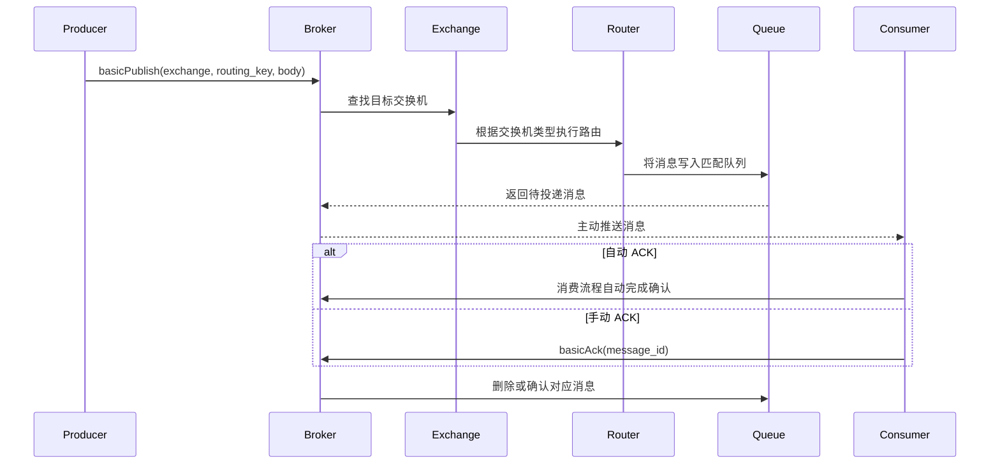

# cpp-rabbitmq

> A lightweight RabbitMQ-like message queue implemented in C++.

基于 **C++11、muduo、Protobuf 和 SQLite3** 实现的轻量级消息队列系统，包含 Broker 服务端、客户端 SDK、交换机与队列管理、消息路由、消息持久化、消费者调度和 ACK 确认等核心模块。

项目采用 muduo 网络库构建 TCP 长连接通信，使用 Protobuf 定义自有应用层协议，实现了类似 RabbitMQ 的 `Connection / Channel` 分层模型，并支持 `DIRECT`、`FANOUT`、`TOPIC` 三种交换机类型。

> 本项目不直接实现 AMQP 协议，而是通过自定义 Protobuf 协议，重点实现消息队列的核心通信链路与关键机制。

## 项目亮点

* 基于 muduo、epoll 和 TCP 长连接实现事件驱动网络通信
* 使用 Protobuf 定义请求、响应和消息投递协议
* 实现一个 `Connection` 管理多个 `Channel` 的分层通信模型
* 支持 `DIRECT`、`FANOUT`、`TOPIC` 三种消息路由模式
* 使用动态规划完成 Topic 模式下 `*` 和 `#` 通配符匹配
* 支持多个消费者之间的 Round Robin 轮询调度
* 支持自动 ACK 和手动 ACK 两种消息确认模式
* 使用 SQLite3 持久化交换机、队列和绑定关系等元数据
* 使用文件存储完成队列消息持久化与 Broker 重启恢复
* 基于请求 ID、哈希表和条件变量实现请求与响应关联
* 将网络 I/O 与业务任务分离，避免业务逻辑阻塞事件循环
* 使用 GTest 验证路由、消费、持久化和资源清理等核心逻辑

## 技术栈

| 技术       | 用途                      |
| -------- | ----------------------- |
| C++11    | 项目主要开发语言                |
| muduo    | TCP 服务端、客户端、事件循环和网络通信   |
| epoll    | Linux 下的事件驱动 I/O 多路复用机制 |
| Protobuf | 应用层协议定义、序列化与反序列化        |
| SQLite3  | 交换机、队列和绑定关系等元数据持久化      |
| 文件存储     | 队列消息持久化与服务重启恢复          |
| GTest    | 核心模块单元测试与功能验证           |
| pthread  | 多线程和业务线程池支持             |
| Makefile | 项目编译与链接                 |

## 核心功能

### 交换机与队列管理

* 声明、删除和查询交换机
* 声明、删除和查询消息队列
* 创建和解除交换机与队列之间的绑定关系
* 删除交换机或队列时清理相关绑定和消息资源
* 支持持久化和非持久化资源属性

### 消息路由

支持以下三种交换机类型：

| 交换机类型    | 路由规则                                  |
| -------- | ------------------------------------- |
| `DIRECT` | `routing_key` 与 `binding_key` 完全一致时匹配 |
| `FANOUT` | 忽略路由键，将消息广播到所有绑定队列                    |
| `TOPIC`  | 使用 `*` 和 `#` 通配符进行模式匹配                |

Topic 模式中的通配符规则：

| 通配符 | 含义        |
| --- | --------- |
| `*` | 匹配恰好一个单词  |
| `#` | 匹配零个或多个单词 |

示例：

```text
binding_key = news.*.pop
routing_key = news.music.pop
result      = true
```

```text
binding_key = news.#
routing_key = news.music.pop
result      = true
```

### 消息发布与消费

* 生产者向指定交换机发布消息
* Broker 根据交换机类型和路由键查找目标队列
* 消息进入匹配的一个或多个队列
* Broker 向已经订阅队列的消费者主动推送消息
* 同一个队列支持注册多个消费者
* 多个消费者之间采用 Round Robin 方式分发消息

### ACK 消息确认

项目支持两种消息确认方式：

* **自动 ACK**：消费流程自动完成消息确认，业务代码不需要显式调用确认接口
* **手动 ACK**：消费者处理完成后主动调用 `basicAck()` 确认消息

手动 ACK 可以让业务代码在消息处理成功后再进行确认，避免消息在业务处理完成前被提前删除。

### 数据持久化

* 使用 SQLite3 保存交换机、队列和绑定关系等元数据
* 使用独立队列文件保存持久化消息
* Broker 启动时加载持久化资源
* 根据队列文件恢复历史消息管理对象
* 删除队列时同步清理对应的持久化数据

## 系统架构


## 消息流转过程



## 核心设计

### 1. Reactor 网络通信模型

项目使用 muduo 构建 TCP 服务端和客户端。

muduo 底层基于 Reactor 模式和 epoll 实现事件驱动网络通信，网络线程主要负责：

* 接收客户端连接
* 监听套接字读写事件
* 接收和发送网络数据
* Protobuf 消息编解码
* 根据消息类型分发请求

业务线程池主要负责执行消息消费等业务任务，从而避免耗时业务逻辑长时间阻塞网络事件循环。

```text
网络线程
    │
    ├── 接收连接
    ├── 读取数据
    ├── Protobuf 解码
    └── 请求分发
            │
            ▼
       业务线程池
            │
            ├── 消费任务
            ├── 消息处理
            └── 回调执行
```

### 2. Connection 与 Channel 分层

一个 TCP 连接对应一个服务端 `Connection` 对象。

一个 `Connection` 可以管理多个 `Channel`，交换机、队列、发布和消费等操作都通过指定的 Channel 完成。

```text
TCP Connection
├── Channel 1
├── Channel 2
└── Channel 3
```

这种设计可以在复用同一条 TCP 连接的同时，对不同业务操作进行逻辑隔离，减少频繁创建网络连接带来的开销。

### 3. Protobuf 应用层协议

客户端和服务端通过 `.proto` 文件统一定义：

* 交换机和队列属性
* 消息基本属性
* Channel 创建与关闭请求
* 交换机和队列操作请求
* 消息发布与订阅请求
* ACK 确认请求
* 通用响应消息
* 服务端消息投递消息

服务端使用 `ProtobufDispatcher` 根据 Protobuf 消息类型，将请求分发给对应的业务处理函数。

```text
TCP 字节流
    │
    ▼
ProtobufCodec
    │
    ▼
Protobuf Message
    │
    ▼
ProtobufDispatcher
    │
    ▼
业务处理函数
```

### 4. 请求与响应关联

muduo 的网络通信是异步的，但客户端接口需要等待对应请求的处理结果。

每个客户端请求都会生成唯一请求 ID，也就是 `rid`。

客户端 Channel 使用类似以下结构保存响应：

```text
unordered_map<rid, response>
```

基本流程如下：

```text
客户端发送请求
    │
    ├── 生成唯一 rid
    ├── 发送 Protobuf 请求
    └── 等待条件变量
            │
            ▼
服务端处理并返回响应
            │
            ▼
客户端收到响应
    │
    ├── 根据 rid 保存响应
    └── 唤醒等待线程
```

通过请求 ID、哈希表、互斥锁和条件变量，将底层异步网络通信封装成较易使用的同步客户端接口。

### 5. Topic 动态规划匹配

Topic 路由首先将 `binding_key` 和 `routing_key` 按照 `.` 分割为单词数组。

随后使用二维动态规划判断两者是否匹配：

```text
dp[i][j]
```

表示：

```text
binding_key 的前 i 个单词
是否能够匹配
routing_key 的前 j 个单词
```

其中：

* 普通单词只能匹配内容相同的一个单词
* `*` 可以匹配任意一个单词
* `#` 可以匹配零个或多个单词

相比简单字符串比较，动态规划可以完整处理 `#` 匹配不同数量单词的情况。

### 6. 消费者轮询调度

每个消息队列拥有独立的消费者管理对象。

同一个队列存在多个消费者时，通过轮转序号选择下一个消费者：

```cpp
index = sequence % consumer_count;
```

每完成一次选择后更新轮转序号，使消息按照 Round Robin 方式分配给不同消费者。

```text
Message 1 ──> Consumer 1
Message 2 ──> Consumer 2
Message 3 ──> Consumer 3
Message 4 ──> Consumer 1
```

### 7. 资源生命周期管理

交换机、队列、绑定关系和消息之间存在关联关系。

项目在资源删除时执行级联清理：

```text
删除交换机
    └── 删除该交换机对应的所有绑定关系

删除队列
    ├── 删除该队列对应的所有绑定关系
    ├── 删除队列中的消息
    ├── 清理消费者
    └── 清理持久化文件
```

该设计可以避免已经失效的绑定、消息或消费者对象继续留在系统中。

## 模块划分

### Broker 服务端

`mqserver` 负责接收客户端连接、解析请求并调用对应业务模块。

| 文件                  | 作用                            |
| ------------------- | ----------------------------- |
| `mq_broker.hpp`     | Broker 服务器、Protobuf 消息注册和请求分发 |
| `mq_connection.hpp` | 服务端连接与 Connection 生命周期管理      |
| `mq_channel.hpp`    | Channel 管理以及交换机、队列、发布和消费请求处理  |
| `mq_host.hpp`       | 虚拟主机，统一管理交换机、队列、绑定和消息         |
| `mq_route.hpp`      | 路由键校验和交换机路由匹配                 |
| `mq_consumer.hpp`   | 消费者管理和 Round Robin 调度         |

### Client 客户端

`mqclient` 对底层网络通信进行封装，为生产者和消费者提供客户端接口。

| 文件                  | 作用                           |
| ------------------- | ---------------------------- |
| `mq_connection.hpp` | 建立 TCP 连接、管理 Channel、分发服务端响应 |
| `mq_channel.hpp`    | 封装交换机、队列、发布、订阅和 ACK 接口       |
| `mq_consumer.hpp`   | 保存消费者标签、队列、ACK 模式和回调函数       |
| `mq_worker.hpp`     | 管理 muduo 网络事件循环线程和业务线程池      |
| `publish_client.cc` | 生产者使用示例                      |
| `consume_client.cc` | 消费者使用示例                      |

### Common 公共模块

`mqcommon` 保存客户端和服务端共用的协议、工具及持久化模块。

| 文件                  | 作用                  |
| ------------------- | ------------------- |
| `mq_msg.proto`      | 交换机、队列、绑定和消息等基础数据结构 |
| `mq_proto.proto`    | 客户端与服务端之间的请求和响应协议   |
| `mq_threadpool.hpp` | 通用业务线程池             |
| `mq_helper.hpp`     | UUID、文件和字符串处理工具     |
| `mq_logger.hpp`     | 日志接口                |

公共模块还包括交换机、队列、绑定和消息持久化管理组件。

### Test 测试模块

`mqtest` 使用 GTest 验证以下核心功能：

* 交换机、队列和绑定关系初始化
* 交换机和队列的声明、查询与删除
* 删除交换机后的绑定关系清理
* 删除队列后的绑定、消费者和消息清理
* 消息发布、消费和 ACK 确认
* 路由键与绑定键合法性校验
* `DIRECT` 精确路由
* `FANOUT` 广播路由
* `TOPIC` 通配符路由
* 消费者创建、删除、查询和轮询选择
* Channel 与 Connection 管理逻辑

## 项目目录

```text
cpp-rabbitmq/
├── mqclient/                  # 客户端通信模块与示例程序
│   ├── mq_channel.hpp
│   ├── mq_connection.hpp
│   ├── mq_consumer.hpp
│   ├── mq_worker.hpp
│   ├── publish_client.cc
│   ├── consume_client.cc
│   └── Makefile
├── mqcommon/                  # 公共协议、工具和持久化模块
│   ├── mq_msg.proto
│   ├── mq_proto.proto
│   ├── mq_msg.pb.h
│   ├── mq_msg.pb.cc
│   ├── mq_proto.pb.h
│   ├── mq_proto.pb.cc
│   ├── mq_threadpool.hpp
│   ├── mq_helper.hpp
│   └── mq_logger.hpp
├── mqserver/                  # Broker 服务端业务模块
│   ├── mq_broker.hpp
│   ├── mq_connection.hpp
│   ├── mq_channel.hpp
│   ├── mq_consumer.hpp
│   ├── mq_host.hpp
│   ├── mq_route.hpp
│   └── Makefile
├── mqtest/                    # GTest 单元测试与模块测试
├── mqthird/                   # 项目依赖的第三方库文件
└── README.md
```

> 目录树仅展示核心文件，完整内容以仓库中的实际目录为准。

## 环境要求

推荐运行环境：

* Linux
* Ubuntu 22.04
* GCC / G++ 7 或更高版本
* GNU Make
* Protobuf 3.x
* muduo
* SQLite3
* GTest
* zlib
* pthread

Ubuntu 可以安装以下依赖：

```bash
sudo apt update

sudo apt install -y \
    build-essential \
    make \
    protobuf-compiler \
    libprotobuf-dev \
    libsqlite3-dev \
    libgtest-dev \
    zlib1g-dev
```

muduo 可以单独编译安装，也可以使用项目 `mqthird` 目录中准备的依赖文件。

## 编译运行

### 1. 克隆项目

```bash
git clone git@github.com:HaoPing0124/cpp-rabbitmq.git
cd cpp-rabbitmq
```

### 2. 生成 Protobuf 代码

如果仓库中已经包含对应的 `.pb.h` 和 `.pb.cc` 文件，可以跳过该步骤。

```bash
cd mqcommon

protoc --cpp_out=. mq_msg.proto
protoc --cpp_out=. mq_proto.proto

cd ..
```

### 3. 编译 Broker 服务端

```bash
cd mqserver
make -j$(nproc)
```

Broker 默认监听：

```text
0.0.0.0:8085
```

服务端可执行文件名称以 `mqserver/Makefile` 中配置的 target 为准。

### 4. 编译客户端

```bash
cd ../mqclient

make publish_client
make consume_client
```

### 5. 启动程序

首先启动 Broker 服务端，然后启动消费者，最后启动生产者。

```text
Broker
    │
    ▼
Consumer
    │
    ▼
Producer
```

消费者示例：

```bash
cd mqclient
./consume_client queue1
```

生产者示例：

```bash
cd mqclient
./publish_client
```

## 客户端使用示例

### 发布消息

```cpp
#include "mq_connection.hpp"

int main()
{
    // 创建客户端异步工作对象
    auto worker = std::make_shared<haoping::AsyncWorker>();

    // 建立与 Broker 的 TCP 连接
    auto conn = std::make_shared<haoping::Connection>(
        "127.0.0.1",
        8085,
        worker);

    // 创建 Channel
    auto channel = conn->openChannel();

    // 扩展参数
    google::protobuf::Map<std::string, std::string> args;

    // 声明 DIRECT 交换机
    channel->declareExchange(
        "exchange1",
        haoping::ExchangeType::DIRECT,
        true,
        false,
        args);

    // 声明消息队列
    channel->declareQueue(
        "queue1",
        true,
        false,
        false,
        args);

    // 将队列绑定到交换机
    channel->queueBind(
        "exchange1",
        "queue1",
        "news.music");

    // 设置消息属性
    haoping::BasicProperties properties;
    properties.set_routing_key("news.music");
    properties.set_delivery_mode(
        haoping::DeliveryMode::DURABLE);

    // 发布消息
    channel->basicPublish(
        "exchange1",
        &properties,
        "Hello cpp-rabbitmq");

    // 关闭 Channel
    conn->closeChannel(channel);

    return 0;
}
```

### 手动 ACK 回调

```cpp
#include "mq_connection.hpp"

void callback(
    const haoping::Channel::ptr &channel,
    const std::string consumer_tag,
    const haoping::BasicProperties *properties,
    const std::string &body)
{
    std::cout << consumer_tag
              << " consumed: "
              << body
              << std::endl;

    // 业务处理成功后手动确认消息
    if (properties != nullptr)
    {
        channel->basicAck(properties->id());
    }
}
```

## 测试

项目使用 GTest 对路由、虚拟主机、消费者管理和资源生命周期等模块进行测试。

进入测试目录并执行编译：

```bash
cd mqtest
make -j$(nproc)
```

主要测试场景包括：

* `DIRECT` 精确路由
* `FANOUT` 广播路由
* `TOPIC` 通配符路由
* 非法 `routing_key` 和 `binding_key`
* 交换机删除后的绑定关系清理
* 队列删除后的绑定和消息清理
* 消息发布、消费和 ACK
* 消费者 Round Robin 轮询选择
* Channel 和 Connection 管理

## Roadmap

* 增加根目录统一构建脚本与 CMake 支持
* 接入 GitHub Actions 自动编译和单元测试
* 增加压力测试、吞吐量统计和性能分析
* 完善优雅停机、异常响应和连接恢复机制
* 增加消息重试、死信队列和延迟队列
* 增加 Docker 开发与运行环境